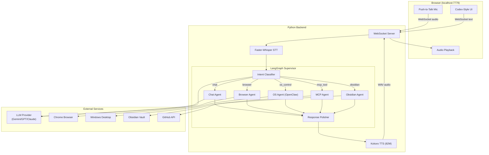

<div align="center">

# J.A.R.V.I.S

### Just A Rather Very Intelligent System

**Open-source, voice-controlled, multi-agent AI framework for Windows**

Built with LangGraph | Kokoro TTS | Browser-Use | OpenClaw | Multi-Provider LLM

[](https://www.python.org/downloads/)
[](LICENSE)
[](CONTRIBUTING.md)

</div>

---

## What is J.A.R.V.I.S?

J.A.R.V.I.S is a free, fast, and intelligent AI assistant framework that brings Tony Stark's AI butler to life. It combines **voice interaction**, **autonomous web browsing**, **Windows desktop control**, and **multi-provider LLM intelligence** into a single, cohesive system you run locally.

Unlike chatbots that just talk, J.A.R.V.I.S **acts** -- it can open your Chrome browser, search the web, navigate websites, launch Windows applications, click buttons, type text, manage files, and interact with your Obsidian knowledge base, all through natural voice or text commands.

### Key Features

| Feature | Description |
|:---|:---|
| **Multi-Provider LLMs** | Supports Gemini 3.5 Flash, GPT-5, Claude Sonnet 5, and OpenRouter models. Switch providers from the UI. |
| **Voice Interface** | ChatGPT-style push-to-talk with local Kokoro TTS (82M params, runs on CPU, Hindi + English) |
| **Autonomous Web Browsing** | Powered by `browser-use` + Playwright. Searches, navigates, extracts, fills forms. |
| **Windows Desktop Control** | OpenClaw integration + PyAutoGUI fallback. Opens apps, clicks UI, types, manages files. |
| **Codex-Style UI** | Minimal dark dashboard with collapsible agent sidebar, settings modal, and real-time status |
| **Obsidian Integration** | Reads and searches your Obsidian vault as a second brain |
| **MCP Tools** | Filesystem and GitHub operations via Model Context Protocol |
| **JARVIS Personality** | Witty, British, proactive, and slightly sardonic -- just like the MCU original |

---

## Architecture



---

## Quick Start

### Prerequisites

- **Python 3.11+**
- **Node.js 22+** (for OpenClaw)
- **FFmpeg** (for audio decoding)
- **Git**
- An API key for at least one LLM provider (Gemini, OpenAI, Anthropic, or OpenRouter)

### Installation

```bash
# Clone the repository
git clone https://github.com/YOUR_USERNAME/project-jarvis.git
cd project-jarvis

# Install Python dependencies via uv (recommended)
pip install uv
uv sync

# Install Playwright browsers
uv run playwright install chromium

# Install OpenClaw (optional, for OS control)
npm install -g openclaw@latest

# Install FFmpeg (Windows)
winget install Gyan.FFmpeg
```

### Configuration

```bash
# Copy the example environment file
cp .env.example .env

# Edit .env with your API key
# Set LLM_PROVIDER to your provider (google, openai, anthropic, openrouter)
# Set the corresponding API key
```

Or configure everything from the dashboard UI (Settings gear icon in the sidebar).

### Run

```bash
uv run jarvis
```

Open **http://localhost:7779** in your browser. That's it.

---

## Usage Examples

| Command | What Happens |
|:---|:---|
| "Search for the latest AI news" | Browser agent opens Chrome, searches Google, returns summary |
| "Open Notepad and type hello world" | OS agent launches Notepad via OpenClaw, types text |
| "What's the weather in Tokyo?" | Chat agent responds with a natural JARVIS-style answer |
| "Find my notes about machine learning" | Obsidian agent searches your vault |
| "List my GitHub repositories" | MCP agent queries the GitHub API |

---

## Project Structure

```
jarvis/
├── brain/               # LangGraph supervisor + intent classification
│   ├── supervisor.py    # StateGraph with 5 agent nodes
│   ├── prompts.py       # JARVIS personality system prompts
│   └── state.py         # Shared AgentState TypedDict
├── agents/              # Specialist agents
│   ├── browser_agent.py # Web automation via browser-use
│   ├── os_agent.py      # OpenClaw + PyAutoGUI
│   ├── chat_agent.py    # Conversational LLM
│   └── obsidian_agent.py
├── transport/           # Audio pipeline
│   ├── pipeline.py      # STT → Supervisor → TTS orchestration
│   ├── tts.py           # Kokoro TTS (local, 82M params)
│   └── stt.py           # Faster-Whisper STT
├── dashboard/           # Web UI
│   ├── server.py        # FastAPI + WebSocket server
│   └── static/index.html # Codex-style dark UI
├── memory/              # Conversation persistence
├── mcp/                 # Model Context Protocol tools
├── config.py            # Multi-provider settings
└── main.py              # Entry point
```

---

## Supported LLM Providers

| Provider | Model | Configuration |
|:---|:---|:---|
| **Google** | `gemini-3.5-flash` | `GEMINI_API_KEY` |
| **OpenAI** | `gpt-5` | `OPENAI_API_KEY` |
| **Anthropic** | `claude-sonnet-5` | `ANTHROPIC_API_KEY` |
| **OpenRouter** | Any free/paid model | `OPENROUTER_API_KEY` |

Switch providers instantly from the Settings panel in the UI -- no restart needed.

---

## Contributing

We welcome contributions! Please:

1. Fork the repository
2. Create a feature branch (`git checkout -b feature/amazing-feature`)
3. Commit your changes (`git commit -m 'Add amazing feature'`)
4. Push to the branch (`git push origin feature/amazing-feature`)
5. Open a Pull Request

---

## License

This project is licensed under the MIT License -- see the [LICENSE](LICENSE) file for details.

---

<div align="center">

**Built with passion by the J.A.R.V.I.S community**

*"I do anything and everything that Mr. Stark requires, including occasionally taking out the trash."*

</div>
